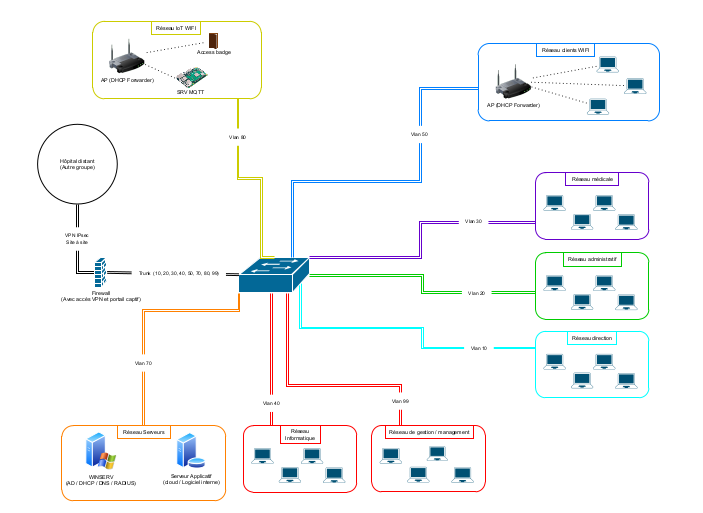

# 🏥 Projet "Hôpital Connecté" 🚀


**Équipe :**  
- Chadi ABOUHNAIK *(IOM)*  
- Souhail AZIZ *(Cybersécurité)*  
- Locqmen HAMDI *(Cybersécurité)*  
- Maxime REDOUTÉ *(PILPRO)*  

---

## 🔍 Contexte  
Avec l'avancée rapide des technologies, les établissements hospitaliers doivent moderniser leurs infrastructures pour garantir une sécurité optimale, une performance accrue et une gestion centralisée. Notre projet vise à répondre à ces besoins en proposant une solution innovante et robuste pour la gestion des données et des communications hospitalières.

---

## 🎯 Objectifs  
Les objectifs principaux sont :  
1. **Protéger les données médicales sensibles** avec une architecture segmentée et sécurisée.  
2. **Connecter les dispositifs IoT** pour une surveillance et une gestion en temps réel.  
3. **Automatiser et centraliser la gestion des tâches hospitalières** à travers une application dédiée.  
4. **Simplifier les communications internes** grâce à une solution de messagerie intégrée.  

---

## 📦 Contenu du Projet  
### 1. 🔧 **Infrastructure Réseau**  
- **Segmentation VLAN** :  
  Isolation des services pour cloisonner les flux entre les différents départements (IoT, administration, médical, etc.).  
- **Pare-feu Stormshield** :  
  Configuration avancée pour analyser et filtrer le trafic réseau, prévenir les intrusions et garantir la conformité aux standards de sécurité.  

### 2. 💻 **Application de Gestion**  
L'application offre les fonctionnalités suivantes :  
- **Gestion des patients** :  
  - Ajout, mise à jour, et consultation des informations patients par service.  
  - Historique des modifications et gestion des droits d'accès par rôle.  
- **Gestion des imprimantes** :  
  - Suivi des consommables (encre, papier).  
  - Alertes automatiques en cas de faible niveau d'encre.  
- **Messagerie interne** :  
  - Intégration avec Nodemailer et Postfix pour l'envoi d'alertes et de notifications.  
  - Historique des messages pour une meilleure traçabilité.  

### 3. 🌐 **Vidéo de Présentation* https://youtu.be/rEwd-Cu7R1c?feature=shared*  
Une **vidéo détaillée** illustre :  
- Le fonctionnement de l'application.  
- La configuration de l'infrastructure réseau.  
- Les cas d'usage spécifiques à chaque département de l'hôpital.  

### 4. 📊 **Dashboard Statistiques** *(option avancée)*  
Un tableau de bord interactif permet :  
- La visualisation des données des imprimantes et des patients.  
- Des graphiques pour un suivi en temps réel des équipements IoT (température, humidité, etc.).  

---

## 📖 Guide d'Installation  

### 🔑 **Prérequis**  
- **Node.js** et **npm** pour exécuter l'application.  
- **Postfix** pour gérer les envois d'emails.  
- **Stormshield** pour sécuriser l'infrastructure.  
- Un **switch managé** pour la segmentation VLAN.  

### ⚙️ **Installation des dépendances Node.js**  
1. **Cloner le dépôt du projet**  
   ```bash
   git clone <URL-du-dépôt>
   cd Hopital
